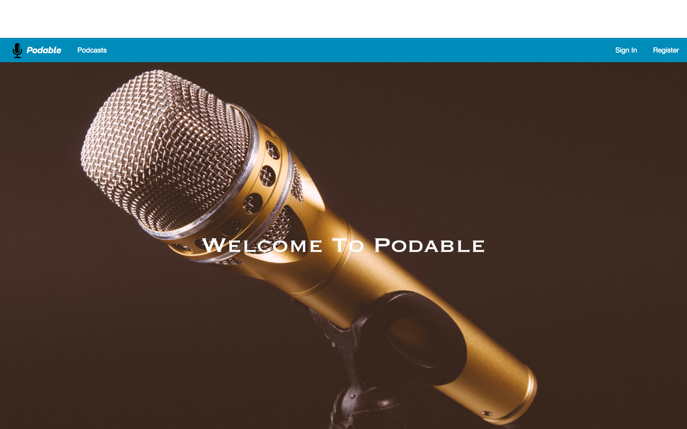
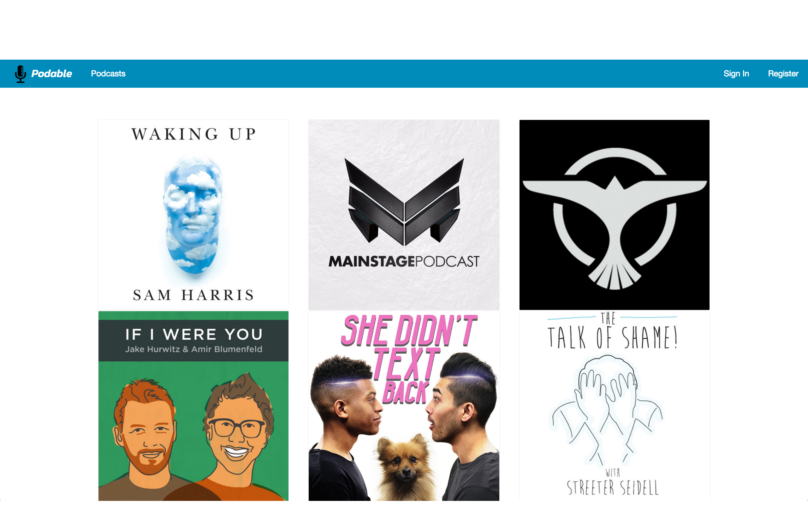

# WDI Project 2: Podable
https://podable.herokuapp.com/

---
## Introduction
### Welcome to Podable

Podable is an online podcast database. Listen to, follow and comment on your favourite podcasts.

---
## Inspiration
Everyone loves to listen to a podcast, and if you don't you need to start!  
For this project I wanted to create a website for people who love podcasts and want to find new podcasts to listen to, as well as interact with other like-minded people in the comments section.

---
## Planning
My main focus of this project was website design, so most of my planning went towards css, although I still dedicated time towards figuring out the relationships of my models.

---
## Design and Code
I used the foundations framework in this project, and wrote the code in ruby, html and css.

---
## Credits
Headgum website for some inspiration towards the idea of the project.  
Soundcloud for linking to the podcast episodes.  
Foundations for the styling.  
SquareSpace for the logo.  